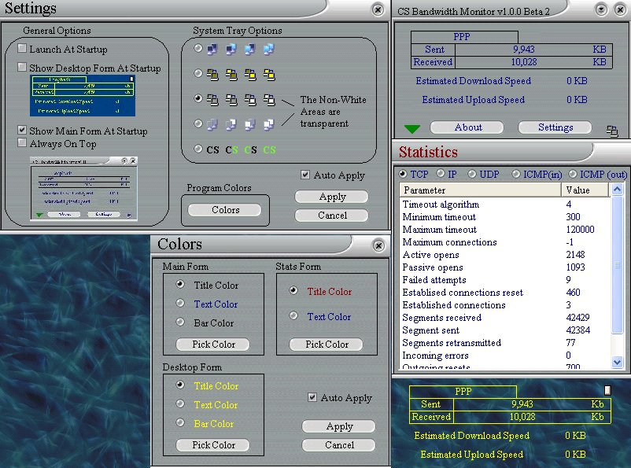



## CS Bandwidth Monitor \- UPDATED \-

### Description

UPDATE(Included stay on top option, fixed some minor bugs and added auto apply to settings. This is beta 2, see pic)

This program has code from antoher tool I have on this site called CS Internet Tools. But the main purpose of this program was to teach myself much better UI. There are alot of nice things about this program such as the form that will blend into your desktop so it looks like it is part of it. The stats form that will "Roll" out of the main form. Really not to hard to do. It will remember where you have your forms at startup, has many options and is very custmizable. A large part of this code came from other source code not by me. All props go to them. I hope this helps anybody who needs it. Vote if you like. Remember the main purpose of this was to teach myself UI. Anyways I hope you do like it.
 
### More Info
 

             |
---                |---
**Submitted On**   |2002-03-05 08:26:14
**By**             |[Shane Croft](https://github.com/Planet-Source-Code/PSCIndex/blob/master/ByAuthor/shane-croft.md)
**Level**          |Intermediate
**User Rating**    |4.8 (201 globes from 42 users)
**Compatibility**  |VB 5\.0, VB 6\.0
**Category**       |[Complete Applications](https://github.com/Planet-Source-Code/PSCIndex/blob/master/ByCategory/complete-applications__1-27.md)
**World**          |[Visual Basic](https://github.com/Planet-Source-Code/PSCIndex/blob/master/ByWorld/visual-basic.md)
**Archive File**   |[CS\_Bandwid59505352002\.zip](https://github.com/Planet-Source-Code/shane-croft-cs-bandwidth-monitor-updated__1-32253/archive/master.zip)

